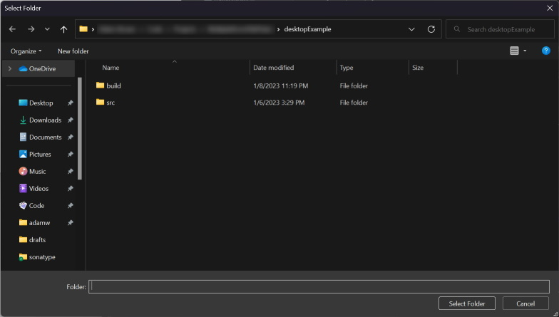
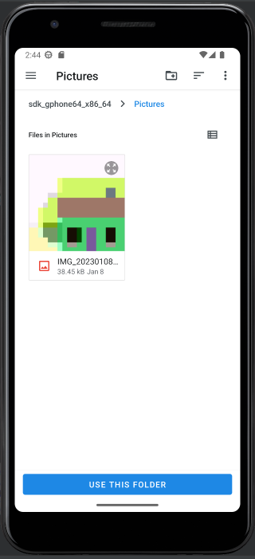

# Compose Multiplatform File Picker

 

![badge-platform-windows] ![badge-platform-linux] ![badge-platform-macos] ![badge-platform-android] ![badge-platform-js] ![badge-platform-macosX64]

![badge-kotlin]

A multiplatform compose widget for picking files with each platform's Native File Picker Dialog.

## Include in your project:

```kts
implementation("com.darkrockstudios:mpfilepicker:2.1.0")
```

## How to use

In your shared jetbrains compose multiplatform code, add one of the following.

To show the dialog, simply set the boolean state to true via a button or what ever you want.

### Pick a file with a filter:

````kotlin
var showFilePicker by remember { mutableStateOf(false) }

val fileType = listOf("jpg", "png")
FilePicker(show, fileExtensions = fileType) { file ->
    showFilePicker = false
    // do something with the file
}
````

### Pick a directory:

````kotlin
var showDirPicker by remember { mutableStateOf(false) }

DirectoryPicker(showDirPicker) { path ->
    showDirPicker = false
    // do something with path
}
````

On each supported platform, it will update the platform native file picker dialog. On desktop, it will fall back to the
Swing file picker if the native one can't be used for some reason.

<details>

<summary>Screenshots</summary>

## Windows



## Android



</details>

## Desktop/JVM Implementation

The native desktop dialog implementation is derived from the [Pacmc project](https://github.com/jakobkmar/pacmc)
but uses [TinyFileDialogs](https://github.com/LWJGL/lwjgl3/blob/master/modules/lwjgl/tinyfd/src/generated/java/org/lwjgl/util/tinyfd/TinyFileDialogs.java)

See `FileChooser.kt` as well as the `lwjgl` gradle filter.

## Building

Intellij IDEA should be able to build the project except Android variant.
To build and run Android examples, use Android Studio.

### JS

run `jsBrowserDevelopmentRun` via Gradle, it will build a JS example and open it in a browser.

### MacOS and JVM

Click on a green button next to the main function in `examples/jvm/.../Main.kt` or `examples/macosX64/.../main.kt`.

### Android

Open the project in Android Studio. A run configuration for Android should be added automatically.
Clicking on it will run it on an emulator.

### iOS

Requirements:
- MacOS
- Xcode
- Android Studio

Setup your environment by following the [Official Multiplatform Mobile Guide](https://kotlinlang.org/docs/multiplatform-mobile-setup.html).
To run iOS example app you also need to follow the [Set-up an environment to work with CocoaPods Guide](https://kotlinlang.org/docs/native-cocoapods.html#set-up-an-environment-to-work-with-cocoapods).  

Open the project in Android Studio, install `Kotlin Multiplatform Mobile` plugin. Create an `iOS Application` run config
and enter the following:
- Xcode Project File: `<project_dir>/examples/iosApp/iosApp.xcworkspace`
- Xcode Project Scheme: `iosApp`
- Xcode Project Cinfiguration: `Debug`
- Execution Target: choose any simulator you have already created

Use it to launch a simulator and run/debug the example iOS App,

[badge-kotlin]: https://img.shields.io/badge/kotlin-1.8.20-blue.svg?logo=kotlin

<!-- PLATFORMS -->

[badge-platform-linux]: http://img.shields.io/badge/platform-jvm/linux-2D3F6C.svg?style=flat

[badge-platform-android]: http://img.shields.io/badge/platform-android-6EDB8D.svg?style=flat

[badge-platform-ios]: http://img.shields.io/badge/platform-ios-CDCDCD.svg?style=flat

[badge-platform-windows]: http://img.shields.io/badge/platform-jvm/windows-4D76CD.svg?style=flat

[badge-platform-macos]: http://img.shields.io/badge/platform-jvm/macos-111111.svg?style=flat

[badge-platform-js]: http://img.shields.io/badge/platform-js-34913c.svg?style=flat

[badge-platform-macosX64]: http://img.shields.io/badge/platform-macosX64-34913c.svg?style=flat
